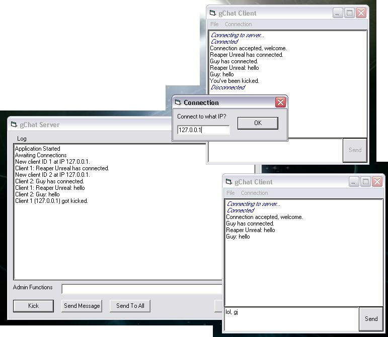

## gChat Multi\-User Internet Chat System

### Description

This is the gChat suite of programs. There is a server program and a chat client program. The programs a pretty self-explanatory. The server will let you kick people, and send messages to single users or everyone online. The server also has a log to see what's going on. The chat client is quite compact and will let you select your name. More revisions to come depending on feedback.
 
### More Info
 

             |
---                |---
**Submitted On**   |2003-07-13 19:23:04
**By**             |[Guillaume Couture\-Levesque](https://github.com/Planet-Source-Code/PSCIndex/blob/master/ByAuthor/guillaume-couture-levesque.md)
**Level**          |Advanced
**User Rating**    |4.5 (18 globes from 4 users)
**Compatibility**  |VB 5\.0, VB 6\.0
**Category**       |[Internet/ HTML](https://github.com/Planet-Source-Code/PSCIndex/blob/master/ByCategory/internet-html__1-34.md)
**World**          |[Visual Basic](https://github.com/Planet-Source-Code/PSCIndex/blob/master/ByWorld/visual-basic.md)
**Archive File**   |[gChat\_Mult1613967132003\.zip](https://github.com/Planet-Source-Code/guillaume-couture-levesque-gchat-multi-user-internet-chat-system__1-46881/archive/master.zip)

